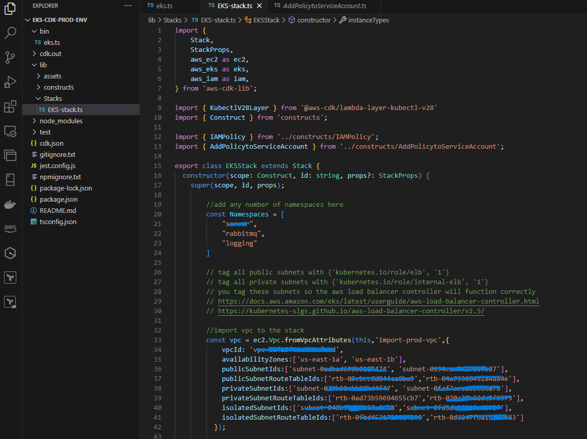

# NXTAssessment
A Repo for NXT Solutions Assessment

# Build the Docker Image
docker build -t nodejs-app .

# Tag the Docker Image and push to DockerHub
docker tag nodejs-app:latest your-dockerhub-username/nodejs-app:latest
docker login
docker push your-dockerhub-username/nodejs-app:latest

# OR
# Push it to Elastic Container Registry (AWS ECR)
aws ecr get-login-password --region your-region | docker login --username AWS --password-stdin your-account-id.dkr.ecr.your-region.amazonaws.com
docker tag nodejs-app:latest your-account-id.dkr.ecr.your-region.amazonaws.com/your-ecr-repo-name:latest
docker push your-account-id.dkr.ecr.your-region.amazonaws.com/your-ecr-repo-name:latest

# This will create the namespace where the application will be running along with the svc and any other needed things
kubectl apply -f nodeapp-namespace.yaml
# This creates the application replicas 
kubectl apply -f nodeapp-deployment.yaml
# This creates a svc that points to the application to be able to hit the application from outside the cluster (loadbalancer in our case)
kubectl apply -f nodeapp-svc.yaml

# Steps to Deploy a Docker Image to AWS EKS
1. Set Up EKS Cluster (if not already set up)
Either using eksctl 
# Create EKS cluster using eksctl
eksctl create cluster --name my-cluster --region us-west-2 --nodegroup-name my-nodes --node-type t3.medium --nodes 3 --nodes-min 1 --nodes-max 4 --managed
# OR using CDK (I prefer this method)
 => This is a snapshot of a part of the script used to provision the EKS cluster

2. After creating the EKS cluster
# We can deploy to it using kubectl (kubectl apply -f nodeapp-deployment.yaml) and so on
# Or we can use a script it's almost the same
# A script for deploying to an EKS Cluster can be like this
----------------------------------------------------------------------
#!/bin/bash

# Variables
CLUSTER_NAME="my-cluster"
REGION="us-west-2"
DEPLOYMENT_FILE="nodeapp-deployment.yaml"
SERVICE_FILE="nodeapp-svc.yaml"
IMAGE_URI="123456789012.dkr.ecr.us-west-2.amazonaws.com/nodejs-app:latest"

# Update kubeconfig
aws eks --region $REGION update-kubeconfig --name $CLUSTER_NAME

# Deploy the application
kubectl apply -f $DEPLOYMENT_FILE
kubectl apply -f $SERVICE_FILE

# Verify deployment
kubectl rollout status deployment/hello-world-deployment
kubectl get services
-------------------------------------------------------------------------

